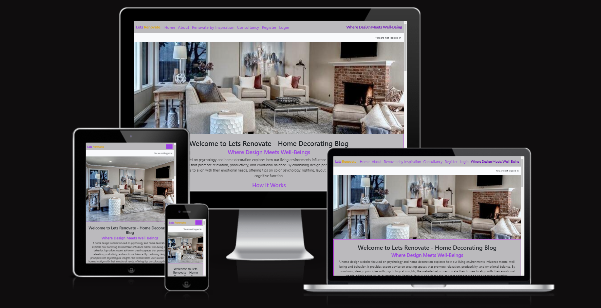
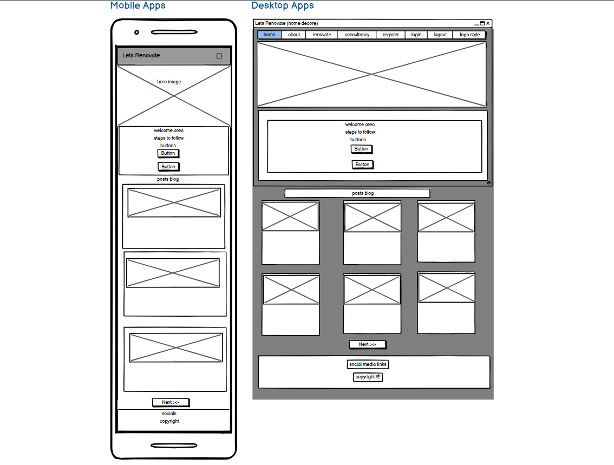
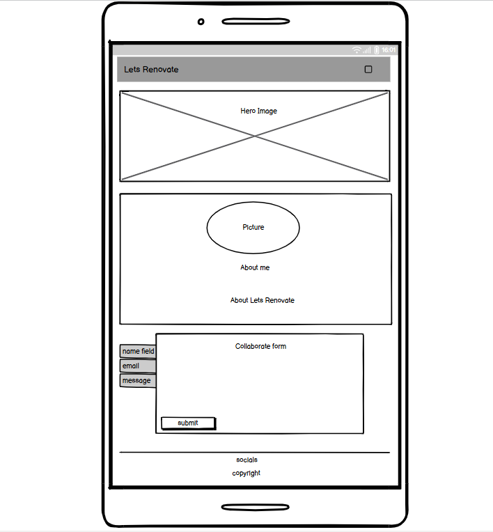
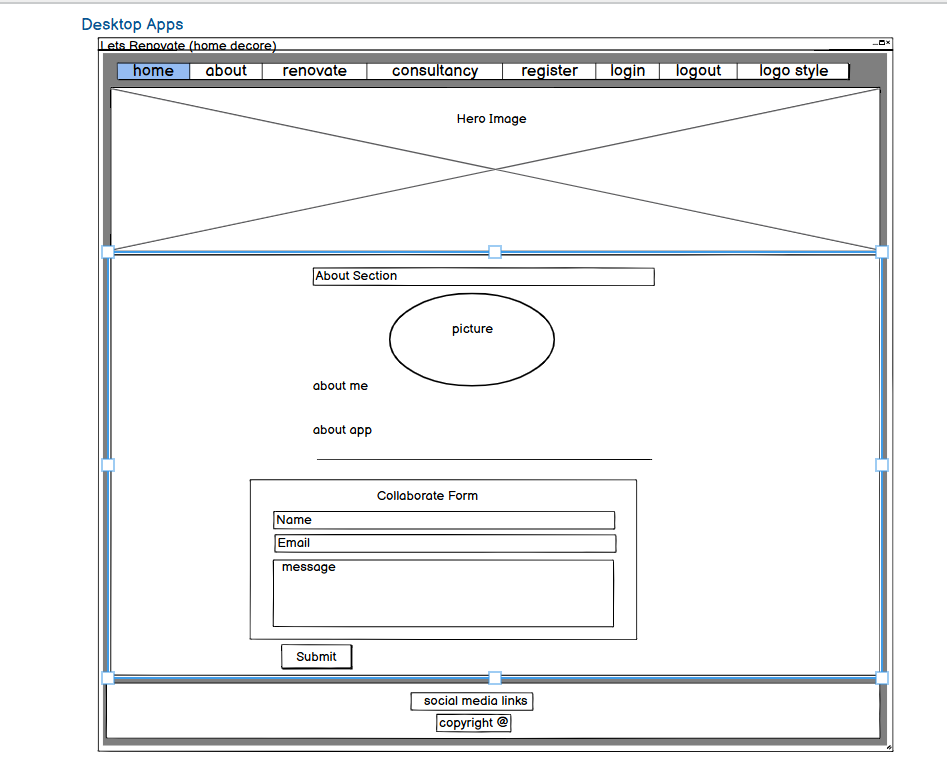
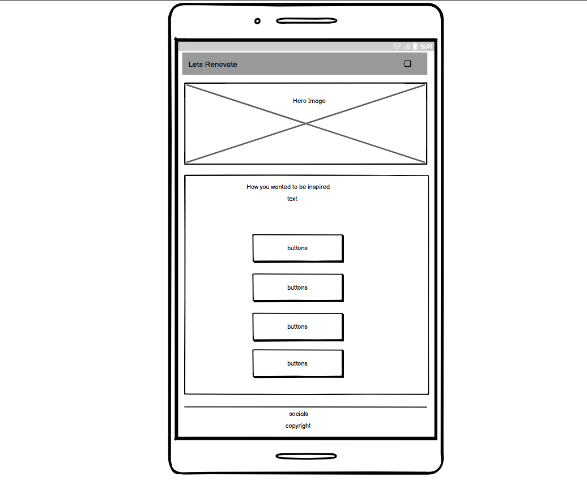
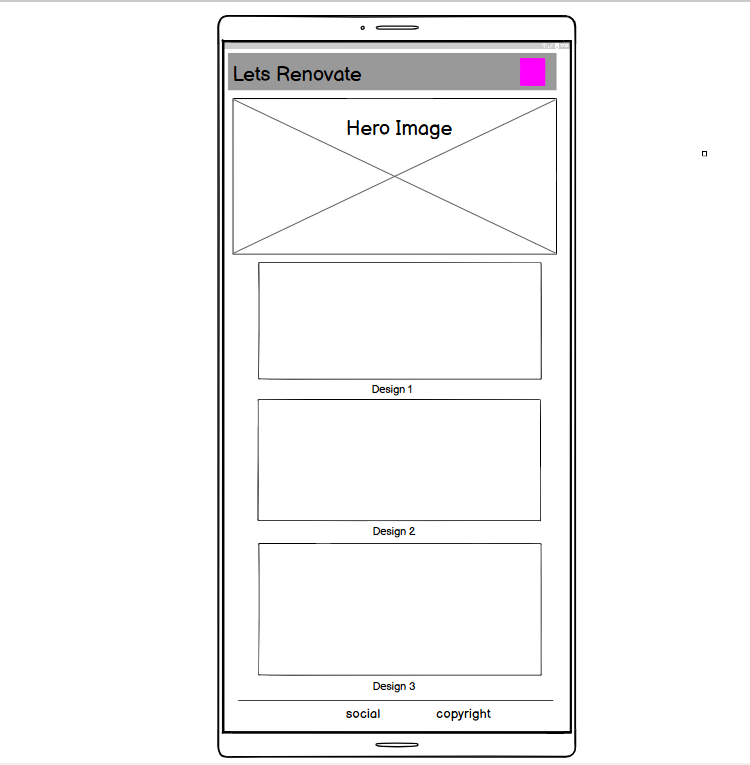
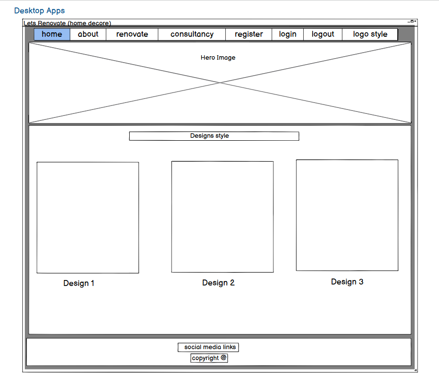
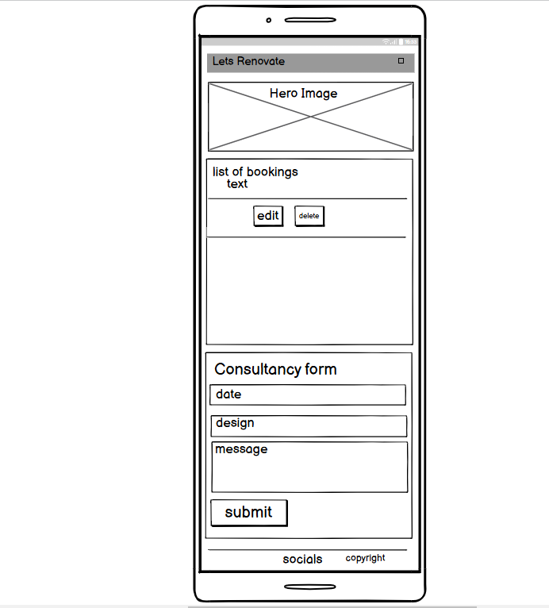
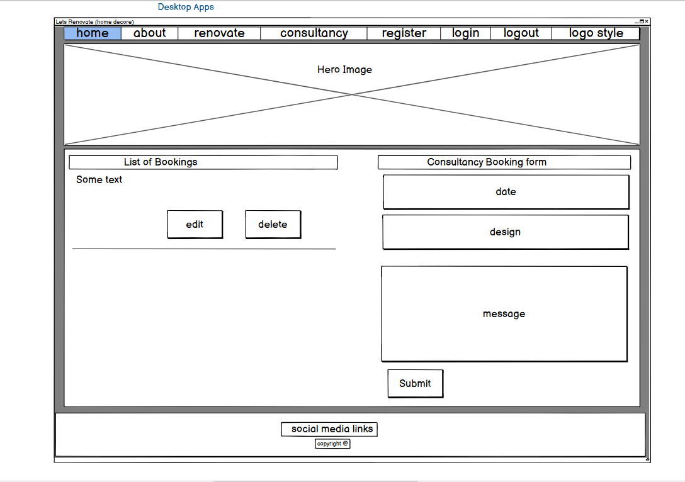

# Lets Renovate - Home Decorating Blog
Developer: Madiha Babri

Lets Renovate is an online platform that focused on psychology and home decoration and explores how our living environments influence mental well-being and behavior. It provides expert advice on creating spaces that promote relaxation, productivity, and emotional balance. By combining design principles with psychological insights, the website helps users curate their homes to align with their emotional needs, offering tips on color psychology, lighting, layout, and decor choices that enhance mood and cognitive function. The project is part of the Code Institute's Full-Stack Developer course and focuses on Django framework, database manipulation, and CRUD functionality.

live site: <a href="https://lets-renovate-99e0f8d1e179.herokuapp.com/">Lets Renovate</a>

Github repository, click <a href="https://github.com/Madiha-babri/home-core">Here</a>

# Table of Contents
1. <a href="#Lets Renovate - Home Decorating Blog">Introduction</a>

# Overview
Lets Renovate is a fictitious business that started out as a blog and it focuses on latest insights in color psychology with expert design techniques to transform users home into a sanctuary that aligns with their personal style and psychological needs. This is a full stack website built using the Django web framework, with the aim of converting blog readers into home designers. This website provides the user with; a blog, comments sections, an about page to read about the business owner and the business itself, a form for users that are not registered to make collaboration requests, and an app for registered website users to make bookings for a consultancy after selecting design and style from inspiration page that provides different designs for different sections of home.

The platform ensures accessibility across all devices and browsers, and its goal is to streamline the process of finding and scheduling consultations. In future iterations, LetsRenovate will add functionality for home designers providers to manage their schedules, send reminders to patients, and offer tools for patient-doctor communication.
# UX - User Experience
### Key project goals
- Educate Users on the Psychological Impact of Colors. Provide visitors with in-depth knowledge about how different colors can influence mood, productivity, and well-being in various home environments.
- Empowering users with information on color psychology helps them make informed decisions about their home renovation choices. It positions the website as an authoritative source of expertise.
- Encourage designers and professionals to get in contact if they would like to collaborate on blog posts or offer their services for our renovation and designing. 
### Target audience
- Homeowners and Renters Seeking Renovation Ideas, whether it's a full renovation or a smaller refresh.
-  Individuals Interested in Mental Health and Wellness, People who are actively seeking to improve their mental and emotional well-being through their living environment.
- Interior Designers and Home Design Professionals,  Professionals who are either already working in the design industry or aspiring to learn more about the psychology of color in home design.
- Eco-Conscious Consumers,  Homeowners or renters who are focused on sustainability and eco-friendly renovation practices and want to create a home that supports both their emotional well-being and environmental values.

### Agile Methodologies
I used an agile approach to project management. The Lets Renovate development process was broken into sprints, and tasks were added to the GitHub project board to be tracked and managed through issues.

### MoSCoW Prioritization
- Must-Haves
- Should-Haves
- Could-Haves

### Sprints
- Sprint 1: Initial Setup - Project, repository, environment setup.
- Sprint 2: User Authentication, post & comment model.
- Sprint 3: DEsign search & Appointment Booking System.
- Sprint 4: Static Pages & UI/UX Improvements.
- Sprint 5: Deployment & Testing

### User stories
1. 
## Wireframes
#### Home Page
Mobile View

Desktop View

#### About Page:@;'>

Mobile View

Desktop View

#### Inspiration Page

Mobile View

Desktop View

#### Design Pages

Mobile View

Desktop View

#### Consultancy Page

Mobile View

Desktop View

.