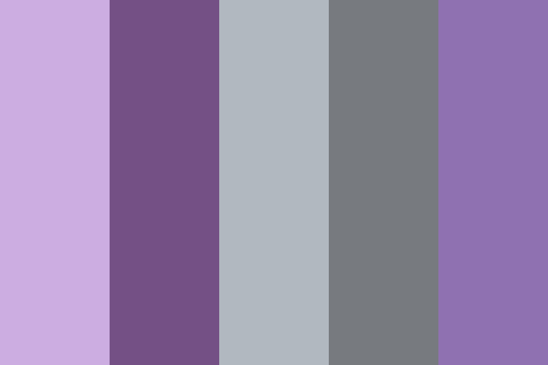

# Lets Renovate - Home Decorating Blog
Developer: Madiha Babri

Lets Renovate is an online platform that focused on psychology and home decoration and explores how our living environments influence mental well-being and behavior. It provides expert advice on creating spaces that promote relaxation, productivity, and emotional balance. By combining design principles with psychological insights, the website helps users curate their homes to align with their emotional needs, offering tips on color psychology, lighting, layout, and decor choices that enhance mood and cognitive function. The project is part of the Code Institute's Full-Stack Developer course and focuses on Django framework, database manipulation, and CRUD functionality.

live site: <a href="https://lets-renovate-99e0f8d1e179.herokuapp.com/">Lets Renovate</a>

Github repository, click <a href="https://github.com/Madiha-babri/home-core">Here</a>

# Table of Contents
1. <a href="#Lets Renovate - Home Decorating Blog">Introduction</a>

# Overview
Lets Renovate is a fictitious business that started out as a blog and it focuses on latest insights in color psychology with expert design techniques to transform users home into a sanctuary that aligns with their personal style and psychological needs. This is a full stack website built using the Django web framework, with the aim of converting blog readers into home designers. This website provides the user with; a blog, comments sections, an about page to read about the business owner and the business itself, a form for users that are not registered to make collaboration requests, and an app for registered website users to make bookings for a consultancy after selecting design and style from inspiration page that provides different designs for different sections of home.

The platform ensures accessibility across all devices and browsers, and its goal is to streamline the process of finding and scheduling consultations. In future iterations, LetsRenovate will add functionality for home designers providers to manage their schedules, send reminders to patients, and offer tools for patient-doctor communication.
# UX - User Experience
### Key project goals
- Educate Users on the Psychological Impact of Colors. Provide visitors with in-depth knowledge about how different colors can influence mood, productivity, and well-being in various home environments.
- Empowering users with information on color psychology helps them make informed decisions about their home renovation choices. It positions the website as an authoritative source of expertise.
- Encourage designers and professionals to get in contact if they would like to collaborate on blog posts or offer their services for our renovation and designing. 
### Target Audience
- Homeowners and Renters Seeking Renovation Ideas, whether it's a full renovation or a smaller refresh.
-  Individuals Interested in Mental Health and Wellness, People who are actively seeking to improve their mental and emotional well-being through their living environment.
- Interior Designers and Home Design Professionals,  Professionals who are either already working in the design industry or aspiring to learn more about the psychology of color in home design.
- Eco-Conscious Consumers,  Homeowners or renters who are focused on sustainability and eco-friendly renovation practices and want to create a home that supports both their emotional well-being and environmental values.

### Agile Methodologies
I used an agile approach to project management. The Lets Renovate development process was broken into sprints, and tasks were added to the GitHub project board to be tracked and managed through issues.

### MoSCoW Prioritization
- Must-Haves
- Should-Haves
- Could-Haves

### Sprints
- Sprint 1: Initial Setup - Project, repository, environment setup.
- Sprint 2: User Authentication, post & comment model.
- Sprint 3: DEsign search & Appointment Booking System.
- Sprint 4: Static Pages & UI/UX Improvements.
- Sprint 5: Deployment & Testing

### User stories
1. 

### Typography
- For main pages Roboto, "Helvetica Neue", Arial, "Noto Sans", "Liberation Sans", sans-serif, were used.

### Colour Scheme
In line with Lets Renovate theme, I chose contrast color palette:
- ### Primary Color: #445261; (dark, muted blue-gray)
- ### Secondary Color: #9b42e4; ( vibrant shade of purple)
- ### Background: #fff (White) This combination ensures clarity, accessibility, and a professional appearance, allowing for easy navigation throughout the site.

## Wireframes
Wireframes were created for the following key pages to ensure an intuitive user journey:

- ### Home Page Wireframes
- Mobile and Desktop

- #### About Page:

- Mobile View

- Desktop View

- #### Inspiration Page

- Mobile View

- Desktop View

- #### Design Pages

- Mobile View

- Desktop View

- #### Consultancy Page

- Mobile View

- Desktop View

### Database Schema - Entity Relationship Diagram
The ERD shown below illustrates the relationships between the users, consultancy appointments, about page, collaborate form, and more. This is essential to demonstrate the relationships between the different models in the PostgreSQL database.

The ERD also demonstrates the platform's role-based structure. In the diagram below it can be seen that User has a relationship to Post, Comment and Booking. Comment has a relationship with both User and Post.

# Features
- ### Navigation bar
A responsive navigation bar is in place. Concentrating on 'mobile first' design, the navigation bar incorporates a clickable burger icon with a drop down menu on mobile. There is a burger icon at tablet size too, but when moving to monitor size the burger disappears and a navigation bar appears with options to navigate to pages; 'Blog' which is essentially the home page, 'About' or 'Book Consultancy'. See mobile and monitor screenshots below.

- ### Mobile Navb-bar with toggler

- ### Desktop Navbar

- ### Hero Image
The hero image was chosen to convey the main topic of the blog site. It is a Designing blog, so an image of a innovative livingroom was used.

- ### Welcome Area
To clearly demonstrate the purpose of website "Welcome Section" is used. To explain how to use the website features, detailed step by step explaination is provided in this section.

- ### Blog Posts
To explain the psychological factors with mental well being and home decoration, posts from different sides were usedcand posted in this section.
On desktop screens there are 3 blog posts displayed in a row and 6 on a page, with the option to use a next and previous button. Large laptop screens and monitor screens have the same layout as tablet size only the pictures are bigger.

- ### Pagination
Pagination makes a long list of blog posts more manageable for users. It is comprised of 'next' and 'prev' buttons. Six blogs are shown per page on this website.

- ### About page
The user does not need to be logged in to view the about page. The hero image at the top. Then the div that tells the user whether they are logged in or not. Followed by; the about title (so that the user can confirm what page they are on), a picture to make it interactive, the content title and the about content. The about content tells the user about the business CEO and bussines strategy that what and how audience is targeted for this website. Also it states, "I believe in the power of shared knowledge and collective effort. Whether you have a project in mind, wish to co-author an article, or simply want to brainstorm some ideas, I'm excited to hear from you. Fill out the form and we can get the ball rolling!"

- ### Renovate by Inspiration page
This page contains hero-image and then div for steps section. It explains that if a user wants to book consultancy for renovating their home or design a new home from scratch, they can select difefrent designs from our website and after that make a booking for consultancy.

- ### Bedrooms Design
This page contain designs for bedrooms. On desktop screen they come 3 in a row, on smaller devices user can see 1 picture at a time and scroll down for more.

- ### Kitchen
This Page shows designs for kitchens.

- ### Washroom
This page shows washroom designs.

- ### Living Rooms
This page is about livingroom designs.

- ### Consultancy Booking
An original custom model is contained in this original custom app. The app is called 'Consultancy' and it has its own template, models, form and views.
Lets Renovate allows registered users to book appointments for consultancy directly through the platform. The system includes:

- Search: Users can search for Designs Style and place their message.
- Book Appointment: Users can book an appointment directly by submitting booking form.
- Appointment Management: Users can view and manage their bookings through their booking list view.
- Appointment Cancellation: Users have the ability to cancel booking with a confirmation prompt.

- ### CRUD Functionality
The following CRUD functionalities are implemented within Lets Renovate:

- ### Create 
Users are automatically assigned a profile upon registration. They can create bookings and post comments.

- ### Read
Users can view their profile and associated information, including Booking lists and comments.

- ### Update
Users have the ability to update their profile information, including Bookings and comments.

- ### Delete
Users can delete bookings and comments at any time.

This CRUD cycle is central to the UserProfile model, ensuring that users can fully manage their bookings & comments while providing system integrity.

- ### User View - Registered/Unregistered
Only registered users can book apointments for consultancy and comment on posts. when users are logged in or out alert message feature is used to notify them.
 
- ### Signup/signin Form
for signup or signing-in forms and alerts were used.

- ### Making Comments on Posts While Sign In
Full front end CRUD functionality is available on comments if the user is logged in. Every time data is created, edited or deleted a notification message pops up to give the user feedback.

- ### Booking Consultancy While Sign In

- ### Django Alert Messages
Every time there is a change in data the user is alerted. For example when a comment is posted, when a comment is edited, when a comment is deleted, when a booking is created, when a booking is edited or when a booking is deleted. There is also an alert message displayed when a collaboration request is made.

- ### Sign in
The first example is a feedback notification that shows "successfully signed in as username" straight after signing in.

- ### Updating/Deleting comments alert
This CRUD functionality was given to registered users.

1. Create

2. Update & Delete

- ### Booking CRUD Functionality Alerts
This CRUD functionality was given to registered users.

1. create

2. Update & Delete

- ### Future Features

- Search bar: A 'search bar' feature on top of every page. This was on the project's kanban board as a 'could have'. However, it was moved to 'won't have' in the allowed timeframe for project submission. it could be impleted in future.

- Review Customised Model: A 'Review' feature on the blog posts and designs with 'like' counter. This was on the project's kanban board as a 'could have'. However, it was moved to 'won't have' in the allowed timeframe for project submission. A review feature is something that can be implemented in future when time allows.

- Escape Key Feature: A 'escape key' that can be pressed to exit any page and go back to home page. This was in could have section but moved to wont have for future implementation.

- Blog Post Layout: a 'blog post layout' feature that can be used to post more images inside posts and under every paragraph. This was in could have category but moved to wont have for future implementation.

- ### Footer
This includes social media iconsn and copyright.

# Technologies & Languages Used

- HTML5 - Markup language for structuring the website
- CSS3 - Styling language for designing the layout and visual aesthetics
- JavaScript - For interactivity and DOM manipulation on the frontend
- Python (Django) - Backend web framework for server-side logic and management
- PostgreSQL - Database management system for storing data
- Cloudinary - Cloud-based image storage solution
- Whitenoise - For serving static files directly from Django

