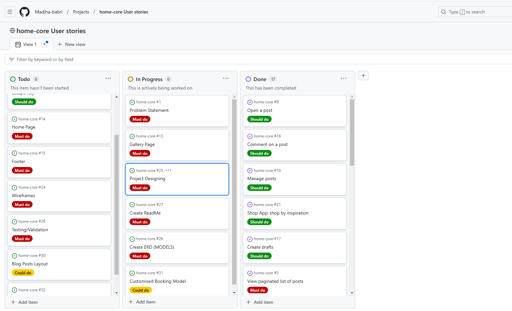
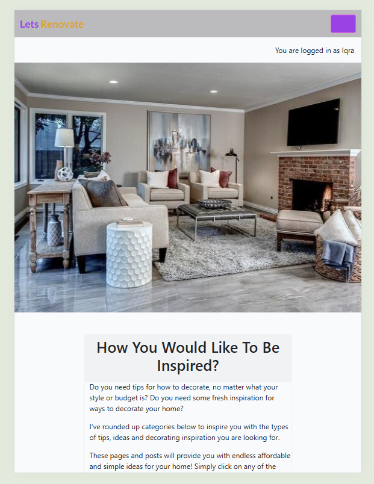
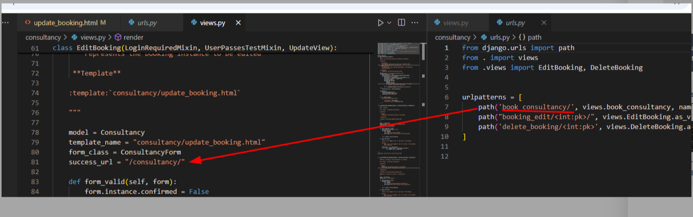

# Lets Renovate - Home Decorating Blog
Developer: Madiha Babri

Lets Renovate is an online platform that focused on psychology and home decoration and explores how our living environments influence mental well-being and behavior. It provides expert advice on creating spaces that promote relaxation, productivity, and emotional balance. By combining design principles with psychological insights, the website helps users curate their homes to align with their emotional needs, offering tips on color psychology, lighting, layout, and decor choices that enhance mood and cognitive function. The project is part of the Code Institute's Full-Stack Developer course and focuses on Django framework, database manipulation, and CRUD functionality.

live site: <a href="https://lets-renovate-99e0f8d1e179.herokuapp.com/">Lets Renovate</a>

Github repository, click <a href="https://github.com/Madiha-babri/home-core">Here</a>

# Table of Contents
1. <a href="#Lets Renovate - Home Decorating Blog">Introduction</a>
2. <a href="#overview">Overview</a>
3. <a href="#ux---user-experience">UX - User Experience</a>
5. <a href="#features">Features</a>
- <a href="#key-project-goals">Key project goals</a>
- <a href="#target-audience">Target Audience</a>
- <a href="#agile-methodologies">Agile Methodologies</a>
- <a href="#moscow-prioritization">MoSCoW Prioritization</a>
- <a href="#sprints">Sprints</a>
- <a href="#wireframes">Wireframes</a>
- <a href="#database-schema---entity-relationship-diagram">Database Schema - Entity Relationship Diagram</a>
6. <a href="#features">Features</a>
- <a href="#navigation-bar">Navigation bar</a>
- <a href="#hero-image">Hero Image</a>
- <a href="#about-page">About page</a>
- <a href="#kitchen">Kitchen</a>
- <a href="#consultancy-booking">Consultancy Booking</a>
- <a href="#booking-crud-functionality-alerts">Booking CRUD Functionality Alerts</a>
- <a href="#future-features">Future Features</a>
- <a href="#footer">Footer</a>
6. <a href="#technologies-&-languages-Used">Technologies & Languages Used</a>
7. <a href="#lets-renovate---home-decorating-blog">Libraries & Frameworks</a>
8. <a href="#testing">Testing</a>
9. <a href="#bugs">Bugs</a>
10. <a href="#deployment">Deployment</a>
11. <a href="#credits">Credits</a>
12. <a href="#acknowledgements">Acknowledgements</a>

# Overview
Lets Renovate is a fictitious business that started out as a blog and it focuses on latest insights in color psychology with expert design techniques to transform users home into a sanctuary that aligns with their personal style and psychological needs. This is a full stack website built using the Django web framework, with the aim of converting blog readers into home designers. This website provides the user with; a blog, comments sections, an about page to read about the business owner and the business itself, a form for users that are not registered to make collaboration requests, and an app for registered website users to make bookings for a consultancy after selecting design and style from inspiration page that provides different designs for different sections of home.

The platform ensures accessibility across all devices and browsers, and its goal is to streamline the process of finding and scheduling consultations. In future iterations, LetsRenovate will add functionality for home designers to have consultancy meetings at home with users, a designing tool where users can test designs and ideas on website before implementing them at their actual homes. 

# UX - User Experience
### Key project goals
- Educate Users on the Psychological Impact of Colors. Provide visitors with in-depth knowledge about how different colors can influence mood, productivity, and well-being in various home environments.
- Empowering users with information on color psychology helps them make informed decisions about their home renovation choices. It positions the website as an authoritative source of expertise.
- Encourage designers and professionals to get in contact if they would like to collaborate on blog posts or offer their services for our renovation and designing. 
### Target Audience
- Homeowners and Renters Seeking Renovation Ideas, whether it's a full renovation or a smaller refresh.
-  Individuals Interested in Mental Health and Wellness, People who are actively seeking to improve their mental and emotional well-being through their living environment.
- Interior Designers and Home Design Professionals,  Professionals who are either already working in the design industry or aspiring to learn more about the psychology of color in home design.
- Eco-Conscious Consumers,  Homeowners or renters who are focused on sustainability and eco-friendly renovation practices and want to create a home that supports both their emotional well-being and environmental values.

### Agile Methodologies
I used an agile approach to project management. The Lets Renovate development process was broken into sprints, and tasks were added to the GitHub project board to be tracked and managed through issues.

### MoSCoW Prioritization
- Must-Haves
- Should-Haves
- Could-Haves

### Sprints
- Sprint 1: Initial Setup - Project, repository, environment setup.
- Sprint 2: User Authentication, post & comment model.
- Sprint 3: Design search & Appointment Booking System.
- Sprint 4: Static Pages & UI/UX Improvements.
- Sprint 5: Deployment & Testing

### User stories
1. As a site owner I can create a functional website so that users can benefit from the information
2. As a site user I can clearly understand the layout/structure of website so that I can access the required section easily.
3. As a site admin I can create a customised nav-bar so that different sections can be accessed anytime
4. As a site user I can search anytime through search bar so that I can find what I am looking for on website. (Futire implementation)
5. As a site user, I can view a paginated list of posts so that I can select which post I want to view."
6. As a site user I can register and login into my account so that my progress save within the site
7. As a Site User / Admin I can view comments on an individual post so that I can read the conversation
8. As a **Site User ** I can modify or delete my comment on a post so that I can be involved in the conversation
9. As a Site User, I can click on a post so that I can read the full text.
10. As a Site Admin I can create, read, update and delete posts so that I can manage my blog content
11. As a Site Admin I can approve or disapprove comments so that I can filter out objectionable comments
12. As a site user I can press escape key so that I can return to home page. (Future implementation)
13. As a site user I can see multiple home decoration ideas so that I can choose which style/design to choose
14. As a site user I can find different innovative rooms/kitchen/washroom ideas so that I can uniquely design every section of my home
15. As a site owner I can create a footer for all pages so that users can easily access the information from any page.
16. As a Site User I can leave comments on a post so that I can be involved in the conversation
17. As a Site Admin I can create draft posts so that I can finish writing the content later
18. As a Site User I can register an account so that I can comment on a post
19. As a Site User I can click on the About link so that I can read about the site.
20. As a Site Admin I can create or update the about page content so that it is available on the site.
21. As a site user I can see home designs and ideas for inspiration so that I can shop through images and implement designs
22. As a student I need to research project ideas so that** I can choose a topic that aligns with my skills and meets the course requirements.
23. As a student I need to define the purpose and target audience of my project so that I can create a solution that meets their needs effectively
24. As a student, I need to create wireframes for my project, so that I can visually plan and structure my pages in alignment with user needs and project requirements.
25. As a Site Owner I need to design the project’s user interface with consistent colors, fonts, and images, so that the project looks visually appealing and provides a good user experience.
26. As a Site Owner I need to create an Entity-Relationship Diagram (ERD) to define my project’s data model,
so that I can organize data relationships and ensure efficient database structure aligned with project requirements.
27. As a student, I need to create a README file for my project, so that users and developers can easily understand the project’s purpose, installation process, and usage.
28. As a Site Owner I can create collaboration form so that **potential collaborator can submit a request for collaboration.
29. As a student I can test/validate all my codes, forms, languages etc so that I can pass all testing and show there is no error in coding
30. As a Student I can develop creative layout of every posts in blog so that more pictures can be added after every paragraph (Future implementation)
31. As a Site Owner I can *create a booking system so that people can book consultancy slots for home review and ideas
32. As a Site Owner I can create a review model so that people can give reviews on designs and ideas present on app

### Typography
- For main pages Roboto, "Helvetica Neue", Arial, "Noto Sans", "Liberation Sans", sans-serif, were used.

### Colour Scheme
In line with Lets Renovate theme, I chose contrast color palette:
- ### Primary Color: #445261; (dark, muted blue-gray)
- ### Secondary Color:  #9b42e4; ( vibrant shade of purple)
- ### Background:  #fff (White) This combination ensures clarity, accessibility, and a professional appearance, allowing for easy navigation throughout the site.

## Wireframes
Wireframes were created for the following key pages to ensure an intuitive user journey:

- ### Home Page Wireframes
- Mobile and Desktop

- #### About Page:

- Mobile View

- Desktop View

- #### Inspiration Page

- Mobile View

- Desktop View

- #### Design Pages

- Mobile View

- Desktop View

- #### Consultancy Page

- Mobile View

- Desktop View

### Database Schema - Entity Relationship Diagram
The ERD shown below illustrates the relationships between the users, consultancy appointments, about page, collaborate form, and more. This is essential to demonstrate the relationships between the different models in the PostgreSQL database.

The ERD also demonstrates the platform's role-based structure. In the diagram below it can be seen that User has a relationship to Post, Comment and Booking. Comment has a relationship with both User and Post.

# Features
- ### Navigation bar
A responsive navigation bar is in place. Concentrating on 'mobile first' design, the navigation bar incorporates a clickable burger icon with a drop down menu on mobile. There is a burger icon at tablet size too, but when moving to monitor size the burger disappears and a navigation bar appears with options to navigate to pages; 'Blog' which is essentially the home page, 'About' or 'Book Consultancy'. See mobile and monitor screenshots below.

- ### Mobile Navb-bar with toggler

- ### Desktop Navbar

- ### Hero Image
The hero image was chosen to convey the main topic of the blog site. It is a Designing blog, so an image of a innovative livingroom was used.

- ### Welcome Area
To clearly demonstrate the purpose of website "Welcome Section" is used. To explain how to use the website features, detailed step by step explaination is provided in this section.

- ### Blog Posts
To explain the psychological factors with mental well being and home decoration, posts from different sides were used and posted in this section.
On desktop screens there are 3 blog posts displayed in a row and 6 on a page, with the option to use a next and previous button. Large laptop screens and monitor screens have the same layout as tablet size only the pictures are bigger.

- ### Pagination
Pagination makes a long list of blog posts more manageable for users. It is comprised of 'next' and 'prev' buttons. Six blogs are shown per page on this website.

- ### About page
The user does not need to be logged in to view the about page. The hero image at the top. Then the div that tells the user whether they are logged in or not. Followed by; the about title (so that the user can confirm what page they are on), a picture to make it interactive, the content title and the about content. The about content tells the user about the business CEO and bussines strategy that what and how audience is targeted for this website. Also it states, "I believe in the power of shared knowledge and collective effort. Whether you have a project in mind, wish to co-author an article, or simply want to brainstorm some ideas, I'm excited to hear from you. Fill out the form and we can get the ball rolling!"

- ### Renovate by Inspiration page
This page contains hero-image and then div for steps section. It explains that if a user wants to book consultancy for renovating their home or design a new home from scratch, they can select different designs from our website and after that make a booking for consultancy.

- ### Bedrooms Design
This page contain designs for bedrooms. On desktop screen they come 3 in a row, on smaller devices user can see 1 picture at a time and scroll down for more.

- ### Kitchen
This Page shows designs for kitchens.

- ### Washroom
This page shows washroom designs.

- ### Living Rooms
This page is about livingroom designs.

- ### Consultancy Booking
An original custom model is contained in this original custom app. The app is called 'Consultancy' and it has its own template, models, form and views.
Lets Renovate allows registered users to book appointments for consultancy directly through the platform. The system includes:

- Search: Users can search for Designs Style and place their message.
- Book Appointment: Users can book an appointment directly by submitting booking form.
- Appointment Management: Users can view and manage their bookings through their booking list view.
- Appointment Cancellation: Users have the ability to cancel booking with a confirmation prompt.

- ### CRUD Functionality
The following CRUD functionalities are implemented within Lets Renovate:

- ### Create 
Users are automatically assigned a profile upon registration. They can create bookings and post comments.

- ### Read
Users can view their profile and associated information, including Booking lists and comments.

- ### Update
Users have the ability to update their profile information, including Bookings and comments.

- ### Delete
Users can delete bookings and comments at any time.

This CRUD cycle is central to the UserProfile model, ensuring that users can fully manage their bookings & comments while providing system integrity.

- ### User View - Registered/Unregistered
Only registered users can book apointments for consultancy and comment on posts. when users are logged in or out alert message feature is used to notify them.
 
- ### Signup/signin Form
for signup or signing-in forms and alerts were used.

- ### Making Comments on Posts While Sign In
Full front end CRUD functionality is available on comments if the user is logged in. Every time data is created, edited or deleted a notification message pops up to give the user feedback.

- ### Booking Consultancy While Sign In

- ### Django Alert Messages
Every time there is a change in data the user is alerted. For example when a comment is posted, when a comment is edited, when a comment is deleted, when a booking is created, when a booking is edited or when a booking is deleted. There is also an alert message displayed when a collaboration request is made.

- ### Sign in
The first example is a feedback notification that shows "successfully signed in as username" straight after signing in.

- ### Updating/Deleting comments alert
This CRUD functionality was given to registered users.

1. Create

2. Update & Delete

- ### Booking CRUD Functionality Alerts
This CRUD functionality was given to registered users.

1. create

2. Update & Delete

- ### Future Features

- Search bar: A 'search bar' feature on top of every page. This was on the project's kanban board as a 'could have'. However, it was moved to 'won't have' in the allowed timeframe for project submission. it could be impleted in future.

- Review Customised Model: A 'Review' feature on the blog posts and designs with 'like' counter. This was on the project's kanban board as a 'could have'. However, it was moved to 'won't have' in the allowed timeframe for project submission. A review feature is something that can be implemented in future when time allows.

- Escape Key Feature: A 'escape key' that can be pressed to exit any page and go back to home page. This was in could have section but moved to wont have for future implementation.

- Blog Post Layout: a 'blog post layout' feature that can be used to post more images inside posts and under every paragraph. This was in could have category but moved to wont have for future implementation.

- ### Footer
This includes social media iconsn and copyright.

# Technologies & Languages Used

- HTML5 - Markup language for structuring the website
- CSS3 - Styling language for designing the layout and visual aesthetics
- JavaScript - For interactivity and DOM manipulation on the frontend
- Python (Django) - Backend web framework for server-side logic and management
- PostgreSQL - Database management system for storing data
- Cloudinary - Cloud-based image storage solution
- Whitenoise - For serving static files directly from Django

# Libraries & Frameworks

- Django - Backend framework
- Django Crispy Forms - For elegant form rendering
- Cloudinary - Media storage
- Whitenoise - For serving static files

# Tools & Programs

- GitHub Projects - Project management and tracking
- Heroku - Deployment and hosting
- Balsamiq - Wireframes and design prototypes

# Testing

## Browser Compatibility

## Responsiveness

## Smaller Screen

- Home

- About

- consultancy

- Renovation

## Medium screen

- Home

- About

- consultancy

- Renovation

## Lighthouse and Performance

### Mobile

- Home

- About

- Inspiration

- Consultancy

### Desktop

- Home

- About

- Inspiration

- Consultancy

## Manual Testing

### Testing Features

## Validation Testing

- ### HTML: W3C Markup Validator.

Every template in Apps was checked. Code was check through HTMl validator. Results for different page source are as followed:

- ### Note:
The errors shown in the above snippets is because base template was used from Django walkthrough project, all other templates are extending through the base.html and errors are caused due to summernote django templates. They are unable to fix, however all other errors caused due to personal coding are emitted/fixed.

- ### CSS: W3C CSS Validator.

Two stylesheets were created fot styling the project. One under static folder and other under staticfiles folder. Both tested and results are clear.

- ### Python: PEP8 validation to ensure code quality.

All the files were tested manually through pep8 validator and results of few are attached below.

# Bugs
- ### Bug Fix #1: INSTALLED_APPS Setting Causing about page Deployment Failure

### Issue:
During the initial setup, about app was not added in list of installed apps and it was not showing on website.

### Steps Taken to Fix:
all settings were checked step by step and 'about' app was eneterd in the list and it fixed the error.

- ### Bug Fix #2: About Picture Issue

### Issue:
I added a picture in about page and it was not showing due to syntax error.

### Steps Taken to Fix:
The syntax was noted and fixed accordingly.

 ### Bug Fix #3: Booking App wrong URL's

### Issue:
I added an app for making bookings and it was not rendering.

### Steps Taken to Fix:
The URL's were created correctly and pasted in right directions. it fixed the rendering error.

### Bug Fix #4: Booking consultancy CRUD functionality not working

### Issue:
I added CRUD functionality on Booking Consultancy, but after filling booking form the list page or confirmation alert was not coming due to incorrect "reverse path".

### Steps Taken to Fix:
The error was showing that no page named "post_details" found, it was wrong path. Real page that was supposed to come up after making booking was Consultancy list page.
The bug was fixed by correcting the URL in views.py file and putting correct paths in urls.py file.

### Bug Fix #5: CRUD Functionality

### Issue:
For customised Booking model, update and delete booking templates were created. Views were added for funstionilty to work but it was not showing on the website. it showed 404 error when tried to update/delete bookings

### Steps Taken to Fix:
I tried to change views and url paths but nothing was working properly. After spending many hours finally took help from student support and they guided me towards correct steps.
Views were changed and correct paths were developed and everything started working properly.

# Deployment
All code for this project was written in Visual Studio/Gitpod as the integrated development environment. GitHub was used for version control, and the application was deployed to Heroku from GitHub.

## Creating Repository on GitHub

- First make sure you are signed into Github and go to the code institutes template, which can be found here.
- Then click on use this template and select Create a new repository from the drop-down. Enter the name for the repository and click Create repository from template.
- Once the repository was created, I clicked the green gitpod button to create a workspace in gitpod so that I could write the code for the site.

## Creating an app on Heroku

- After creating the repository on GitHub, head over to heroku and sign in.
- On the home page, click New and Create new app from the drop down.
- Give the app a name(this must be unique) and select a region I chose Europe as I am in Europe, Then click Create app

## Pre-Deployment

To ensure a successful deployment to Heroku, the following practices are to be followed (Experience from previous Django projects):

- Requirements File:  The requirements.txt file must be kept up to date to ensure all imported Python modules are configured correctly for Heroku.
- Procfile:  A Procfile was added to configure the application as a Gunicorn web app on Heroku.
- Allowed Hosts:  In settings.py, the ALLOWED_HOSTS list was configured to include the Heroku app name and localhost. Example format:

ALLOWED_HOSTS = ['your-app-name.herokuapp.com', 'localhost']

- Environment Variables:  All sensitive data such as the DATABASE_URL, CLOUDINARY_URL, and SECRET_KEY were added to the .env file, which is ignored by Git using .gitignore. These variables are added to Heroku manually through the Config Vars section.

## Deploying with Heroku

The steps for deploying to Heroku are as follows (Experience from previous Django projects):

1. Create New App: Log in to your Heroku account and click on the "Create New App" button.
2. App Name: Choose a unique name for your app.
3. Select Region: Choose the appropriate region (Europe was selected for this project).
4. Create App: Click the "Create App" button to proceed.
5. Deployment Method: In the "Deploy" tab, select GitHub as the deployment method.
6. Connect to GitHub: Search for the repository name and click "Connect".
7. Manual or Automatic Deployment: Select either manual or automatic deployment. Ensure the main branch is selected for deployment.
8. Config Vars: In the "Settings" tab, click "Reveal Config Vars" and input the required environment variables.
9. Buildpack: Select Node.js and Python as the buildpacks for your project.
10. Deploy: Once the configuration is complete, click the "Deploy Branch" button. After successful deployment, a "View" button will appear to take you to the live site.

## Fork this repository:

- Go to the GitHub repository
- Click on the Fork button in the upper right-hand corner

## Clone this Repository

1. Clone this Repository
2. Go to the GitHub repository.
3. Click the "Code" button at the top of the page.
4. Choose between 'HTTPS', 'SSH', or 'GitHub CLI' depending on your preference.
5. Click the copy button to copy the URL.
6. Open Git Bash.
7. Change the working directory to where you want to clone the directory.
Type:
8. git clone https://github.com/easybulb/healmate
9. Press Enter to create the local clone.

- Note: The difference between a clone and a fork is that with a clone, you need permission to push changes to the original repository, whereas a fork creates an entirely new project under your GitHub account.

# Credits

## Code

- Django Documentation: The official docs were invaluable in setting up the project structure and solving specific issues.
- Django Crispy Forms Documentation: Used to streamline form rendering.
- Chatgpt AI: For some coding ideas
- Favicon.io: For Favicon generation.
- Google Fonts: For typography.
- Mark Brisco - Code Institute: For general guidance.
- John Rearden - Code Institute: General guidance
- Statement Beauty- For Booking Customised Model help was taking from <a href="https://statement-beauty-ec9472f892b1.herokuapp.com/">Statement Beauty</a>

## Media

- Icons and images sourced from Canva, ChatGPT and google pictures.
- The hero image is from googlepixels
- Designs styles images from <a href="https://theinspiredroom.net//">The Inspired Room</a>

# Acknowledgements
- My very special thankx to friends and family for supporting me in each and every step of creating this project. Specially my Husband "Mohammed Babri" for looking over all home chores and my three little girls while I was busy in creating this super project Lets Renovate.
- My Mentors and advisors, Marko, John Rearden and Mark Briscoe for helping me at every stage. This project would not have been the same without his invaluable mentorship.

